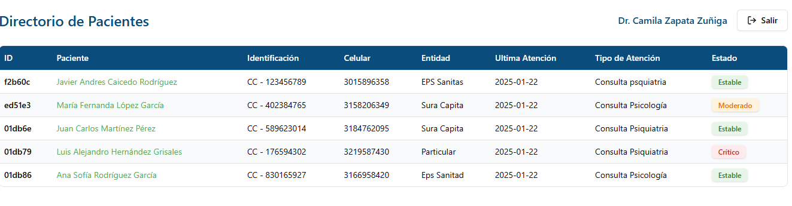
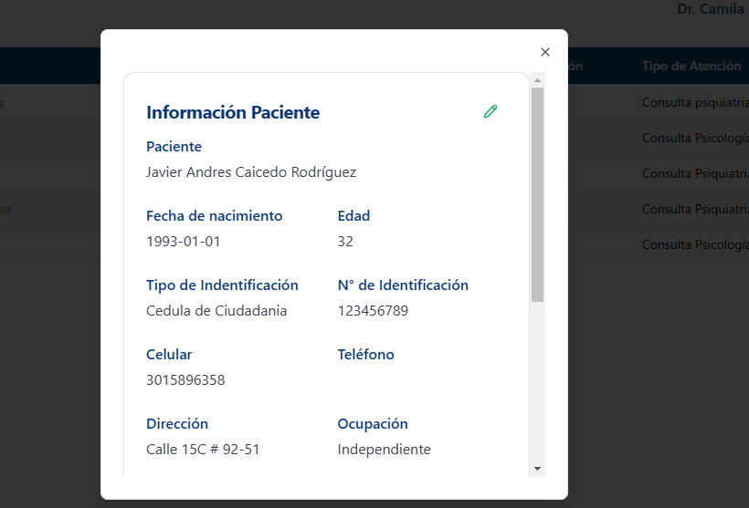
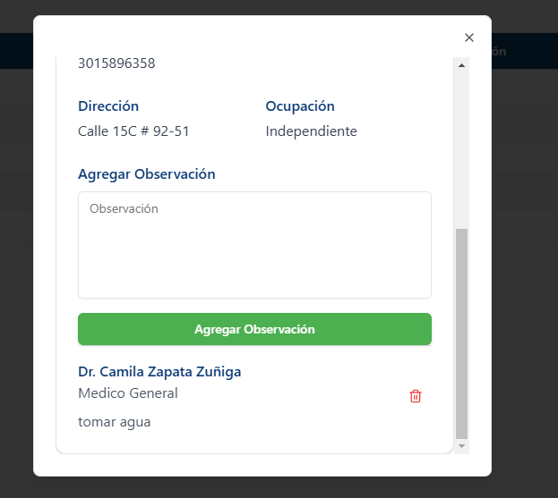

# Sistema de Gestión de Pacientes 🏥

## Descripción
Sistema web para gestión de pacientes médicos que permite actualizar información y agregar observaciones de forma sencilla e intuitiva.

## Tecnologías Utilizadas
- React
- Vite
- Tailwind CSS
- React Router

## Requisitos Previos
- Node.js (v18+)
- npm o yarn

## Instalación

1. Clonar el repositorio
```bash
git clone https://github.com/redmoart23/medical-record-client.git
cd medical-record-client
```

2. Instalar dependencias
```bash
npm install
# o
yarn install
```

## Configuración

Crear un archivo `.env` con las siguientes variables:
```
VITE_URL=https://tu-backend-api.com/api
```

## Comandos

- Iniciar servidor de desarrollo
```bash
npm run dev
# o
yarn dev
```

- Construir para producción
```bash
npm run build
# o
yarn build
```

## Características ✨
- Actualización de información médica
- Gestión de observaciones
- Interfaz responsive
- Autenticación de usuarios

## Capturas de Pantalla

### Pantalla de Login


### Pantalla Principal


### Formulario de Paciente




## Contribución
1. Haz un fork del proyecto
2. Crea tu rama de características (`git checkout -b feature/nuevaCaracteristica`)
3. Realiza commit de tus cambios (`git commit -m 'Agregar característica'`)
4. Sube tus cambios (`git push origin feature/nuevaCaracteristica`)
5. Abre un Pull Request

## Licencia
Proyecto bajo [Licencia MIT](LICENSE)

## Contacto
Tu Nombre - tu.email@ejemplo.com
